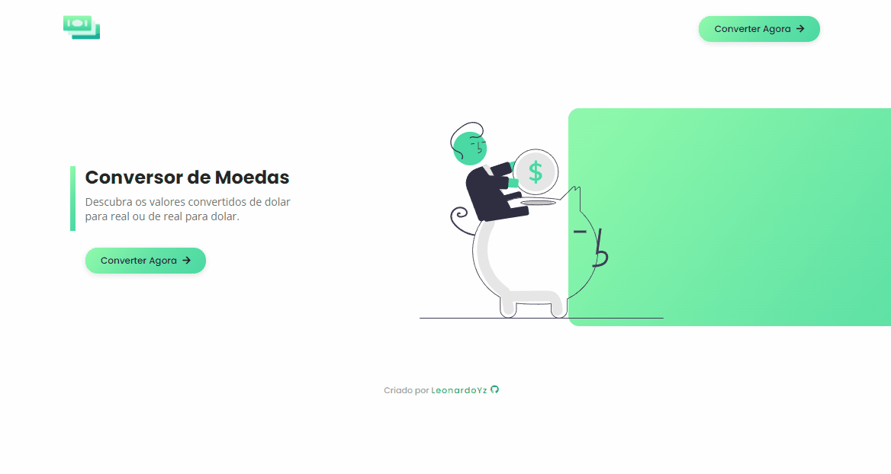
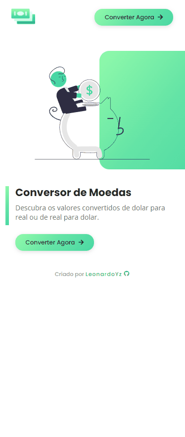

<h1 align="center">Currency Converter</h1>

  <h3>My solution to the currency converter challenge (Imersão Dev of <a href="https://www.alura.com.br/" target="_blank">Alura</a>)</h3>

  <h2>
    <a href="">
      Demo
    </a>
  </h2>

 
  <h3>🖥️ Desktop</h3>
  

 

  <h3>📱 Mobile</h3>
  

#
<h3>🔨 Built with</h3>

<ul>
  <li>Semantic HTML5 markup</li>
  <li>CSS custom properties</li>
  <li>Flexbox</li>
  <li>Javascript</li>
</ul>
